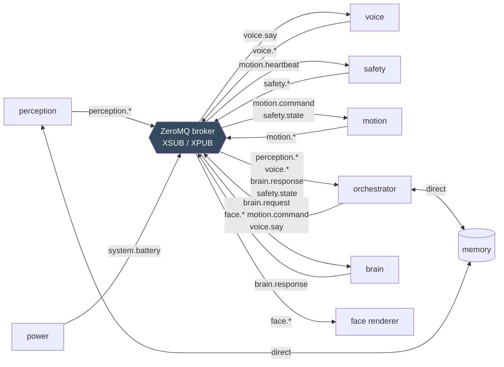
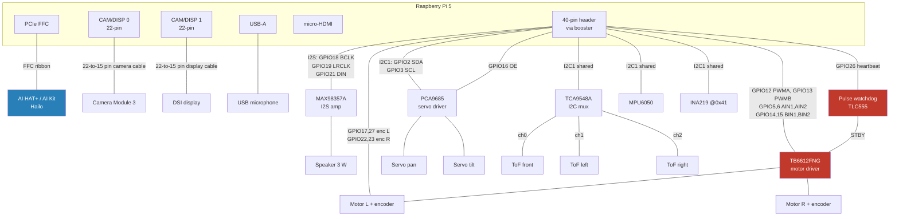
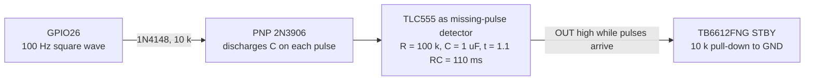
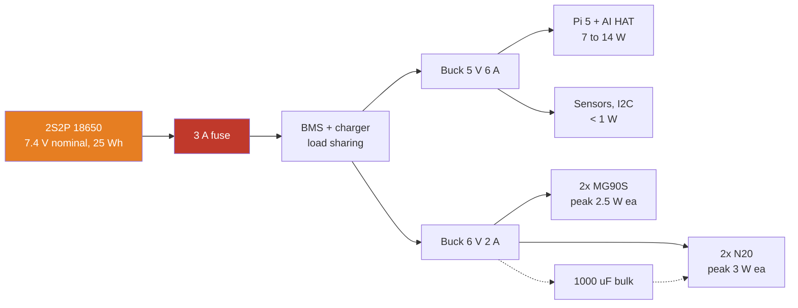
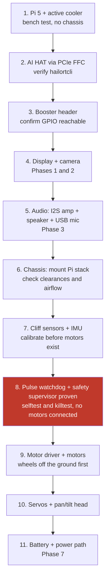

# Hardware

Bill of materials, wiring, pinouts and assembly for the desktop companion robot.

Diagrams are Mermaid and render on GitHub. The pinout table in section 5.2 is authoritative;
`src/robot/data/defaults.yaml` carries the same numbers and the software validates them.

---

## 1. Design principle

The software detects whatever display and camera are attached and adapts (see
`HARDWARE_ABSTRACTION.md`). This BOM is a **recommendation, not a requirement**. Swap any line
for what you own or what ships fastest, and set one config value.

Two things are fixed: the actuator budget is **four channels** (two DC drive motors plus two
servos), and the motor driver's standby pin is wired to **GPIO26 and nothing else**.

---

## 2. Bill of materials

Prices are approximate. Verify before ordering.

### 2.1 Already owned

| Item | Notes |
|---|---|
| Raspberry Pi 5, 8 GB | The brain |
| Official active cooler | Mandatory inside a chassis |
| 27 W USB-C PSU | Bench power for phases 1 to 6 |
| microSD 128 GB A2 | Get a second one. You will corrupt the first. |
| Hailo AI Kit / AI HAT+ (Hailo-8L or 8) | Face detection and embedding. An AI HAT+ 2 (Hailo-10H) also runs the language model and speech-to-text on-chip; see `PLAN.md` 2 |

### 2.2 Tier 1: brain and face, tethered (buy first, ~$100)

| Part | Suggested | Approx | Why |
|---|---|---|---|
| Camera | Pi Camera Module 3, standard 75 degree | $25 | Autofocus matters at desk distance. Any UVC webcam also works. |
| Camera cable | **Pi 5 camera cable, 22-pin to 15-pin**, 200 or 300 mm | $2 | The Pi 5 has 22-pin mini connectors. Camera Module 3 ships with a 15-pin cable that does not fit. |
| Display, phase 1 | Any HDMI monitor | $0 | Works out of the box. Use it until the panel arrives. |
| Display, recommended head panel | Waveshare 2.8" DSI LCD, 480x640, capacitive touch | $30 | Plug and play through the kernel's `vc4-kms-dsi-waveshare-panel,2_8_inch` overlay. Rectangular. Needs the Pi 5 **display** cable (22 to 15 pin), which is a different part from the camera cable. Rev 2.2 or later for the Pi 5. |
| Display, if it must be round | Waveshare 3.4" HDMI round display, 800x800 | $65 | Zero driver work; takes the micro-HDMI port. Big for a small robot. |
| Display, cheap and round | 1.28" GC9A01 SPI round LCD, 240x240 | $8 | Supported by the `spi` backend (driver written, not yet run on hardware). Small, reads as a "creature" eye pair. |
| Display, budget rectangular | 1.69" ST7789 SPI, 240x280 | $12 | Supported by the `spi` backend |
| Not recommended | "2.1 inch round DSI 480x480" panels | | Bare ST7701S panels without a Raspberry Pi overlay: days of kernel work. Pimoroni's HyperPixel 2.1 Round is DPI and takes the whole GPIO header. |
| Microphone | Small USB mic or USB conference mic | $15 | USB avoids the HAT/GPIO conflict. ReSpeaker HATs fight the AI HAT for the header. |
| Amplifier | MAX98357A I2S breakout | $6 | Far better than a USB dongle |
| Speaker | 3 W 4 ohm, 40 mm | $4 | |
| GPIO access | 40-pin stacking/booster header, 20 mm or taller | $8 | The AI HAT physically covers the header |
| Jumpers, JST, heatshrink | | $15 | |

### 2.3 Tier 2: mobility, four actuators (~$100)

| Part | Suggested | Qty | Approx | Why |
|---|---|---|---|---|
| Drive motors | N20 6 V gearmotor, 150 to 300 RPM, **with magnetic encoder** | 2 | $22 | Encoders are not optional for repeatable turns |
| Motor driver | **TB6612FNG dual H-bridge breakout** | 1 | $6 | One PWM pin per motor. The Pi 5 has hardware PWM only on GPIO 12/13/18/19 and 18/19 carry I2S, so this is the only way to get 20 kHz motor PWM. A DRV8833 works but only with ~800 Hz software PWM (audible, jittery). Do not use an L298N. |
| Pulse watchdog parts | TLC555 (CMOS 555), 100 kohm, 1 uF, 10 kohm x2, 1N4148 | 1 set | $2 | Turns the supervisor's heartbeat into the driver's STBY level. See 5.3. |
| Pull-down | 10 kohm resistor on STBY to GND | 1 | | STBY must read low when nothing drives it |
| Head servos | MG90S metal gear micro servo | 2 | $12 | Plastic SG90 gears strip within a week of face tracking |
| Servo driver | PCA9685 16-channel I2C PWM | 1 | $8 | Jitter-free, separate power rail |
| Pan/tilt bracket | 2-axis micro servo bracket | 1 | $8 | Or 3D print one |
| Wheels | 40 mm rubber, 3 mm D-shaft | 2 | $6 | |
| Caster | 12 mm ball caster | 1 | $4 | |
| Cliff sensors | VL53L1X ToF breakout | 3 | $18 | All ship at address 0x29, see 7 |
| I2C mux | TCA9548A | 1 | $5 | Simpler than XSHUT sequencing for three sensors |
| IMU | MPU6050 | 1 | $4 | Pickup, tilt, bumps. The BNO085 is better but its I2C mode is unreliable on a Pi (clock stretching); use its UART-RVC mode if you want it, on a USB serial adapter. |
| Chassis | 3D printed, or a small 2WD platform | 1 | $0 to $40 | Minimum 120x120 mm to carry Pi + HAT |

### 2.4 Tier 3: untethered power (~$80)

Do this last.

| Part | Suggested | Approx | Why |
|---|---|---|---|
| Cells | 2S2P 18650, ~25 Wh, with BMS | $30 | 1.5 to 2.5 hours |
| Buck converter | 5 V 6 A synchronous, not an LM2596 | $12 | Pi 5 browns out on a weak rail under motor transients |
| Motor rail buck | 6 V 2 A | $6 | Separate rail, see 6 |
| Charger | 2S Li-ion charger with load sharing | $12 | |
| Power monitor | INA219 I2C | $6 | Feeds `system.battery`. Strap A0 so it lives at 0x41. |
| Switch, fuse, connectors | | $14 | Fuse the battery. Please fuse the battery. |

**Total, all tiers: roughly $280.**

---

## 3. System architecture

See `PLAN.md` section 1 for the block diagram and the process table. The red box there is the
safety supervisor: it can stop the motors regardless of what anything else wants, including the
language model.

---

## 4. Process and bus topology

Separate OS processes, not threads. The face must keep rendering at 30 fps while the language
model saturates all four cores, and a shared GIL makes that impossible.

---

## 5. Wiring

### 5.1 Block wiring

### 5.2 Pinout (authoritative)

| BCM | Pin | Function | Connects to |
|---|---|---|---|
| 2 | 3 | I2C1 SDA | PCA9685, TCA9548A, MPU6050, INA219 |
| 3 | 5 | I2C1 SCL | same bus |
| 4 | 7 | Display reset | SPI panels only |
| 5 | 29 | TB6612FNG AIN1 | Motor L direction |
| 6 | 31 | TB6612FNG AIN2 | Motor L direction |
| 12 | 32 | TB6612FNG PWMA (hardware PWM0 ch0) | Motor L speed |
| 13 | 33 | TB6612FNG PWMB (hardware PWM0 ch1) | Motor R speed |
| 14 | 8 | TB6612FNG BIN1 | Motor R direction. **Do not enable the header UART.** |
| 15 | 10 | TB6612FNG BIN2 | Motor R direction |
| 16 | 36 | PCA9685 OE (active low) | Servo output gate for layouts without a drivetrain |
| 17 | 11 | Encoder L, channel A | Motor L |
| 18 | 12 | I2S BCLK | MAX98357A |
| 19 | 35 | I2S LRCLK | MAX98357A |
| 20 | 38 | (claimed by the I2S overlay) | leave free |
| 21 | 40 | I2S DIN | MAX98357A |
| 22 | 15 | Encoder R, channel A | Motor R |
| 23 | 16 | Encoder R, channel B | Motor R |
| 24 | 18 | Display backlight | SPI panels only |
| 25 | 22 | Display D/C | SPI panels only |
| 26 | 37 | **Safety enable line** | Pulse watchdog input, or TB6612FNG STBY directly in `level` mode |
| 27 | 13 | Encoder L, channel B | Motor L |
| 8, 9, 10, 11 | 24, 21, 19, 23 | SPI0 CE0, MISO, MOSI, SCLK | SPI panel only |
| 7 | 26 | SPI0 CE1 | claimed while SPI is enabled; leave free |

I2C addresses in use: PCA9685 `0x40`, INA219 `0x41` (strapped; the default `0x40` collides with
the PCA9685), MPU6050 `0x68`, TCA9548A `0x70`, VL53L1X `0x29` behind the mux, SSD1306 OLED
`0x3C` if you use one.

Nothing else may be wired to STBY. The motion service never touches GPIO26; only the safety
supervisor does, and `robot safety selftest` shows you it works with a multimeter before a motor
is ever powered.

### 5.3 The pulse watchdog

A Raspberry Pi GPIO keeps its last level when the process driving it is killed. A supervisor
that simply holds GPIO26 high can therefore die and leave the motors enabled. To get a true
failsafe, the supervisor emits a **square wave** on GPIO26 (`--enable-mode pulse`, 100 Hz) and a
missing-pulse detector converts it to a steady STBY level that collapses within about 110 ms of
the last edge.

Classic circuit: TLC555 (CMOS, runs from 3.3 V) wired as a monostable, with the PNP across the
timing capacitor so each pulse resets the timing cycle; the output stays high while pulses keep
arriving faster than 1.1 RC and falls when they stop. Power it from the Pi's 3.3 V pin. Any
retriggerable monostable (74HC123) or a 20-line ATtiny program does the same job.

If you skip the circuit, run in `level` mode and know that `robot safety killtest` will report
the truth: the line stays high after a SIGKILL. In `level` mode the motion service's own
watchdog (it stops driving when `safety.state` goes stale for a second) is your remaining
protection against a hung supervisor, and nothing protects against a hung motion process.

---

## 6. Power

### 6.1 Power budget

| Load | Idle | Typical | Peak |
|---|---|---|---|
| Pi 5 | 3.5 W | 7 W | 11 W |
| Hailo-8L | 0.5 W | 2.5 W | 5 W |
| Display (2.8" DSI) | 0.4 W | 0.8 W | 1.2 W |
| Audio amp + speaker | 0.1 W | 0.8 W | 3 W |
| Servos (2) | 0.1 W | 1.5 W | 5 W |
| Motors (2) | 0 W | 2 W | 6 W |
| Sensors, I2C | 0.3 W | 0.4 W | 0.5 W |
| **Total** | **~5 W** | **~15 W** | **~32 W** |

At 15 W average, 25 Wh gives roughly **1.6 hours**. Peaks do not sum in practice, but size the
5 V rail for the peak anyway.

### 6.2 Power rules

1. **Separate rails.** Motors and servos never draw through the Pi's 5 V pins.
2. **Common ground only**, tied at one point near the buck outputs.
3. **1000 uF bulk capacitance** on the motor rail, close to the TB6612FNG.
4. **Fuse the battery.**
5. **Pi 5 undervoltage presents as random software bugs.** Check `dmesg | grep -i voltage`
   before debugging anything weird.

---

## 7. Known conflicts and gotchas

| Issue | Fix |
|---|---|
| The AI HAT physically covers the 40-pin header | 20 mm+ stacking header, or a GPIO ribbon breakout |
| The AI HAT occupies the only M.2 slot | No NVMe unless you use a dual M.2 HAT. Stay on a good A2 SD card. |
| Pi 5 camera/display connectors are 22-pin | Buy the Pi 5 adapter cables. Camera and display cables are different parts. |
| Only GPIO 12/13 are free for hardware PWM (18/19 are I2S) | TB6612FNG (one PWM per motor). `dtoverlay=pwm-2chan,pin=12,func=4,pin2=13,func2=4` |
| GPIO14/15 are motor pins | Never set `enable_uart=1`. The Pi 5 debug UART connector is separate. |
| A killed process leaves a GPIO at its last level | Pulse watchdog (5.3) and `--enable-mode pulse`; `robot safety killtest` measures it |
| All three VL53L1X ship at I2C `0x29` | TCA9548A mux (recommended) or XSHUT sequencing at boot |
| INA219 and PCA9685 both default to `0x40` | Strap INA219 to `0x41` |
| BNO085 I2C clock stretching | Use an MPU6050, or the BNO085 in UART-RVC mode |
| Servos inject noise onto shared power | Dedicated 6 V rail plus bulk capacitance |
| MG90S gears strip from instant full-travel commands | Slew limiting in the HAL (`max_deg_s`) |
| Servos cook when held against a mechanical stop | Auto-relax after 3 s idle, enforced in the HAL |
| Pi 5 + Hailo in a closed chassis overheats | Active cooler plus real airflow holes. `robot doctor` reports throttling. |
| PCIe runs at Gen 2 by default | `dtparam=pciex1_gen=3` |
| MAX98357A silent on Trixie | `dtoverlay=max98357a`, `dtparam=audio=off`, the `deploy/alsa/asound.conf`; see `INSTALL.md` troubleshooting |
| Motor PWM whine | 20 kHz hardware PWM (TB6612FNG); the DRV8833 software path cannot avoid it |

---

## 8. Assembly order

Step 8 is not optional and not reorderable. Prove with a multimeter that STBY drops when the
supervisor is killed, with no motors attached, before any motor is ever wired.

Step 9: run the wheels with the chassis propped on a block so they spin free. Verify direction
(`invert:` in the actuator map), encoder counts (`robot calibrate drive`) and the cliff estop
before it ever touches a desk.

---

## 9. Minimum viable variants

| Variant | Parts | What you get |
|---|---|---|
| **Desk face** | Pi + HDMI monitor + USB webcam + USB mic + USB speaker | Recognises you, greets you, talks. No motion. Zero new parts if you own a webcam. Works without a Hailo (CPU perception). |
| **Head only** | Add DSI panel, I2S audio, PCA9685, 2 servos, bracket | Tracks your face with real head movement. No drivetrain, no cliff risk. Layout C or A without the dc driver. |
| **Full** | Add TB6612FNG, motors, watchdog, chassis, cliff sensors, IMU | Drives |
| **Untethered** | Add battery, bucks, BMS, INA219 | Cordless |

Build them in that order. Each one is satisfying on its own, which matters when a project runs
for months.
