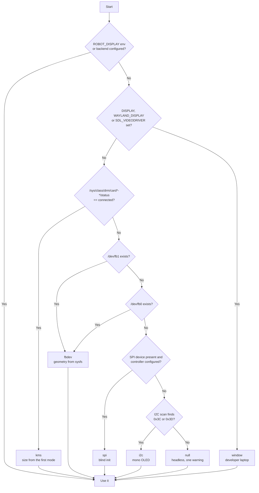
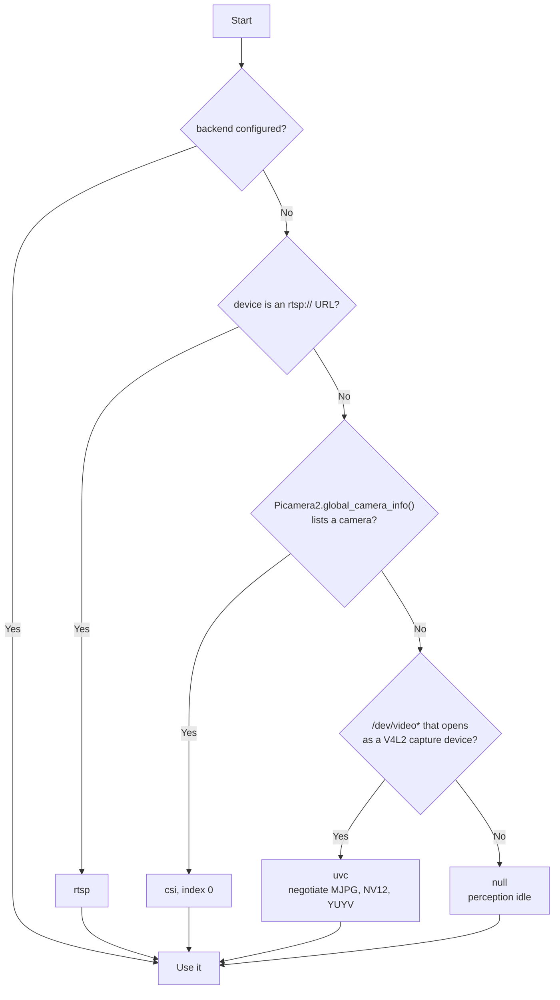

# Hardware Abstraction: any display, any camera, any actuator layout

**Design goal:** the robot boots and runs on whatever display, camera and actuator set is
physically attached, detected at startup, with no code changes and at most one line of config.

Everything here is implemented in `src/robot/hal/` and has a mock. What has and has not been
exercised on real hardware is stated per section; `REVIEW.md` has the summary table.

---

## 0. Honest scope of "it just works"

| Hardware | Auto-detected? | Notes |
|---|---|---|
| HDMI monitor | Yes | DRM/KMS connector status; rendered through SDL kmsdrm or the `/dev/fb0` framebuffer |
| DSI panel with a kernel overlay (official, Waveshare) | Yes | Also a DRM/KMS device |
| SPI LCD with an `fbtft` overlay loaded | Yes | Appears as `/dev/fb1` |
| SPI LCD, direct driver (ST7789, ILI9341, ILI9488, GC9A01) | Partly | Most wiring omits MISO, so the ID register cannot be read. **One config line** names the controller. |
| I2C OLED (SSD1306, SH1106) | Yes | I2C scan at 0x3C / 0x3D |
| No display | Yes | Headless; `face.state` still published |
| CSI camera (libcamera) | Yes | picamera2 |
| USB webcam (UVC) | Yes | V4L2 through OpenCV; MJPG negotiated first |
| RTSP camera | No | URL must be configured |
| Recorded file | No | `camera.backend: file`, `camera.device: clip.mp4` |
| No camera | Yes | Perception idles with a warning, everything else runs |
| Actuators | No | Declared in `config/hardware.yaml`; software cannot probe which GPIO you soldered a motor to |

An I2C OLED face will look bad (128x64, 1-bit). It is supported so nothing crashes, not because
it is a good choice.

---

## 1. Display layer

### 1.1 Configuration

```yaml
display:
  backend: auto        # auto | kms | fbdev | spi | i2c | window | null
  device: auto         # /dev/dri/card1, /dev/fb1, spi0.0, 0x3C, or auto
  controller: auto     # st7789 | ili9341 | ili9488 | gc9a01 | ssd1306 | sh1106
  shape: auto          # auto | rect | round
  rotation: 0          # 0 | 90 | 180 | 270, the value that makes the face upright
  flip: none           # none | h | v | hv
  color: auto          # auto | rgb888 | rgb565 | bgr888 | mono1
  scale_mode: fit      # fit | fill | stretch
  width: null          # panel size; null = detected
  height: null
  target_fps: 30
  min_fps: 15          # adaptive quality floor
  brightness: 1.0
  spi:
    bus: 0
    device: 0
    speed_hz: 62500000
    pin_dc: 25
    pin_reset: 4
    pin_backlight: 24
    x_offset: 0        # some ST7789 panels are offset in the controller's RAM
    y_offset: 0
  i2c_address: 0x3C
```

`backend: auto` runs the cascade below. Anything set explicitly skips detection for that field.

### 1.2 Detection cascade



`robot display detect` prints the decision and the reason for it; `--save` writes it to
`config/local.yaml`. The cascade is unit tested with injected probes.

### 1.3 Backends

| Backend | Implementation | Typical fps | Status |
|---|---|---|---|
| `kms` | pygame-ce (SDL kmsdrm), fullscreen, `SDL_KMSDRM_DEVICE_INDEX` from the connected card | 60 | Written, not yet run on a Pi. SDL 2.30+ fixed the Pi 5 corruption bug; pygame-ce 2.5 ships 2.32 |
| `fbdev` | numpy conversion + `mmap` of `/dev/fbN`, RGB565 / XRGB8888 / RGB888 | 30 to 60 | Verified against a file; covers fbtft SPI panels and the Pi 5's KMS framebuffer emulation |
| `spi` | `spidev` + three GPIOs, Adafruit init sequences, RGB565 (RGB666 for ILI9488) | 30 to 50 at 240x240 | Verified against a recording transport; not yet on a panel |
| `i2c` | SSD1306/SH1106 page writes, thresholded | 10 to 20 | Verified packing; not yet on a panel |
| `window` | pygame-ce window | vsync | Verified (also with SDL's dummy driver in CI) |
| `null` | Discards frames, keeps the last one | n/a | Verified |

Every backend implements the same `Display` interface (`open`, `push(surface)`, `close`,
`set_brightness`, `healthy`). Adding a panel type means adding an init tuple, not touching the
renderer.

### 1.4 Resolution and shape independence

* The face is geometry in a **128x64 design space** (Cozmo's), not pixels. The renderer maps
  the 128-unit width across the panel's short edge (`fit`), or covers it (`fill`), or stretches.
  `face.design_scale` (default 1.15) enlarges the eyes.
* `shape: round` pulls the eyes inward by 12% and masks the corners. Auto-detected for a GC9A01
  and for panels whose framebuffer name says round; otherwise set it.
* `color: mono1` switches to a two-colour preset with no antialiasing. A dithered soft-edged eye
  on a 1-bit OLED looks like static.
* Panels under 160 px on the short edge drop antialiasing.
* Rotation and flip are applied as a final surface transform, so a panel mounted sideways in the
  head costs one config line. `robot display test --pattern` shows a block "F" so you can see
  rotation and mirroring in one glance.

### 1.5 Adaptive quality

The renderer keeps a rolling p95 of frame time. If it exceeds the frame budget for 2 seconds it
degrades one step, logging each: 1 disable idle drift; 2 disable antialiasing; 3 halve the
saccade rate; 4 lower the frame rate toward `min_fps` in 5 fps steps. After 10 good seconds it
climbs back one step at a time. Verified in tests.

### 1.6 CLI

```bash
robot display detect          # run the cascade, print what was found and why
robot display detect --save   # write the result into config/local.yaml
robot display test            # cycle all expressions, print present() timing
robot display test --pattern  # colour bars, RGB squares, grid, circle, orientation glyph
robot bench face              # render-only ms/frame at 240, 480 and 800 px
```

### 1.7 Acceptance criteria

* Renders correctly and at the configured fps on a desktop window, a KMS device, an fbtft
  `/dev/fb1`, a direct-driven ST7789 or GC9A01, and an SSD1306. The first is CI-tested with
  `SDL_VIDEODRIVER=dummy`; fbdev, SPI and I2C are tested against fakes; real panels are
  `robot display test`.
* With no display attached, the whole stack starts, logs one warning, and runs (verified in the
  simulator, which uses the `null` backend).
* Changing `rotation` needs no code change; the transform is unit tested.
* A 128x64 mono panel produces a legible two-colour face (verified).
* Yanking the HDMI cable does not crash the face service: the pipeline falls back to `null`
  (verified with a display that reports unhealthy).

---

## 2. Camera layer

### 2.1 Configuration

```yaml
camera:
  backend: auto        # auto | csi | uvc | rtsp | file | synthetic | null
  device: auto         # /dev/video0, camera index, rtsp:// URL, or a video file
  width: 640
  height: 480
  fps: 30
  format: auto         # auto | MJPG | YUYV | NV12
  rotation: 0
  flip: none
  mirror_preview: true # mirror ONLY the on-screen preview (robot camera test); the detector sees the real image
```

The original `hflip_for_mirror` was removed: mirroring the detector's input is never right, and
whether the eyes should move toward the viewer's left or right is decided in the orchestrator
(`orchestrator.mirror_gaze`).

### 2.2 Detection cascade



For UVC the negotiated format and measured fps are logged at startup, and `robot camera bench`
tells you when a webcam silently gave you 10 fps of YUYV.

### 2.3 Normalisation

Every backend delivers `Frame(image: HxWx3 uint8 RGB, ts, seq)`. Conversion happens once, in the
backend (picamera2's "RGB888" is BGR in memory; that swap lives in `csi.py` and nowhere else).

For models with a fixed input size, `letterbox(image, w, h)` does an aspect-preserving resize
with grey padding and returns the transform, so detections map back to frame coordinates. The
round trip is property-tested across aspect ratios. Do not stretch; it degrades detection.

### 2.4 Synthetic and file backends

`synthetic` draws a moving person-shaped blob so the camera path, letterboxing and benchmarking
run on any machine. `file` replays a clip recorded with `robot camera record out.mp4`, paced to
its frame rate and looped, which is how you tune the recognition threshold repeatably instead of
pacing around your desk.

### 2.5 CLI

```bash
robot camera detect [--save]
robot camera test            # live preview on the display, fps counter, detection boxes
robot camera bench           # measured fps, frame interval, timeouts, format warnings
robot camera record out.mp4  # capture a session for replay
```

### 2.6 Acceptance criteria

* Perception runs unchanged against `csi`, `uvc`, `file` and `synthetic` (same class, same
  service).
* With no camera, the stack starts, perception logs a warning and idles (verified in the
  simulator).
* Letterbox transform round-trips (property tested).
* Negotiated format and fps are logged at INFO (implemented).
* Unplugging a USB camera does not crash perception: reads fail, the backend reopens with
  exponential backoff (implemented; not yet exercised with a real unplug).

---

## 3. Perception backends

| Backend | Detector | Embedder | Threshold (cosine) | Runs on |
|---|---|---|---|---|
| `cpu` | YuNet (OpenCV Zoo) | SFace, 128-d | 0.363 | Any CPU; laptop and Pi without Hailo |
| `hailo` | SCRFD 2.5G (8L) / 10G (8, 10H) | ArcFace MobileFaceNet, 512-d | 0.5 | Hailo-8L, 8, 10H via HailoRT |

`perception.backend: auto` tries Hailo, then CPU. Embeddings are stored per backend and are not
comparable across backends, so re-enrol after switching. `perception.match_threshold` overrides
the backend default.

---

## 4. Actuator layer: four channels

The code treats the four actuators as a **map of roles to channels**, so you can rewire
without touching code.

### 4.1 The three sensible layouts

| Layout | Channels | Pros | Cons |
|---|---|---|---|
| **A. Pan/tilt head** (default) | 2 DC drive + servo pan + servo tilt | Tracks faces without moving the body. Best for a desk robot that mostly sits still. | Pan joint needs a bearing or it sags |
| **B. Authentic Vector** | 2 DC drive + servo head tilt + servo lift arm | Exactly what Vector has; the lift is most of its personality. No pan bearing. | Must turn the body to look at you (`shake` wiggles the treads) |
| **C. Static expressive** | 4 servos: pan, tilt, 2 arms | No drivetrain, no cliff risk, cheapest | Does not drive |

`config/hardware.example.yaml` has all three ready to copy. All three load and report their
primitives (verified).

### 4.2 Configuration

```yaml
actuators:
  layout: A
  drivers:
    dc:
      type: tb6612fng          # tb6612fng | drv8833 | none
      pins: {pwma: 12, ain1: 5, ain2: 6, pwmb: 13, bin1: 14, bin2: 15, standby: 26}
      pwm_hz: 20000            # above audible range; needs hardware PWM (GPIO12/13)
      hardware_pwm: true
    servo:
      type: pca9685            # pca9685 | gpio_pwm | none
      i2c_bus: 1
      i2c_address: 0x40
      pwm_hz: 50
      oe_pin: 16               # PCA9685 output enable, the safety gate when there is no dc driver
  channels:
    drive_left:  {role: drive, driver: dc, motor: a, invert: false, encoder: {pin_a: 17, pin_b: 27, ticks_per_rev: 700}}
    drive_right: {role: drive, driver: dc, motor: b, invert: true,  encoder: {pin_a: 22, pin_b: 23, ticks_per_rev: 700}}
    head_pan:    {role: pan,  driver: servo, channel: 0, min_deg: -70, max_deg: 70, center_us: 1500, us_per_deg: 10.0, max_deg_s: 180, relax_after_s: 3.0}
    head_tilt:   {role: tilt, driver: servo, channel: 1, min_deg: -30, max_deg: 35, center_us: 1500, us_per_deg: 10.0, max_deg_s: 180}
  geometry:
    wheel_diameter_mm: 40
    track_width_mm: 95
    ticks_per_mm: null         # written by `robot calibrate drive`
  max_speed_mm_s: 250
```

Roles: `drive`, `pan`, `tilt`, `lift`, `arm_left`, `arm_right`. Primitives derived from the map:
`look_at`, `center` (pan or tilt present), `nod` (tilt), `shake` (pan, or the drivetrain in
layout B), `drive`, `turn` (drivetrain), `lift`, `wave`, plus `stop` and `relax` always. A role that
is absent makes its primitives unavailable and the orchestrator's requests for them are ignored
rather than errors.

### 4.3 Safety implications of the map

* Every servo channel has a hard `min_deg`/`max_deg` clamp in the HAL, below any calling code
  (verified: a 500 degree request settles at the limit).
* Every servo has a slew limit; a 140 degree step at `max_deg_s: 180` takes at least 0.78 s
  (verified).
* Servos relax after `relax_after_s` idle: pulses stop, the coil cools, and exactly one "off"
  command is sent (verified).
* The dc driver's `standby` pin is owned by the safety supervisor; the motor driver code never
  writes it (verified: the mock GPIO log shows no writes to GPIO26 from the bridge). With no dc
  driver the supervisor gates the PCA9685 OE pin instead.
* Motion refuses to drive without a fresh `safety.state enabled=true` (verified).

### 4.4 Calibration

```bash
robot calibrate servos     # jog each channel with keys; mark min / centre / max
robot calibrate drive      # drive a nominal 500 mm, enter the actual distance, derive ticks_per_mm
robot calibrate cliff      # sample each sensor on the desk and over the edge; set thresholds
```

All three write to `config/local.yaml`. Calibration values are per robot and never committed.

### 4.5 Acceptance criteria

* All three layouts load and the motion service reports exactly which primitives exist
  (verified).
* Commanding beyond a limit is clamped and logged (verified with the mock).
* An idle servo stops receiving pulses after 3 s (verified).
* Slew: a 140 degree step takes at least `140 / max_deg_s` seconds (verified).
* Layout C boots the full stack with no drivetrain and no drive primitives (verified).
* Swapping `invert` reverses a wheel with no code change (verified).

---

## 5. Sensors and power

| Device | Driver | Status |
|---|---|---|
| VL53L1X x3 behind TCA9548A | Pimoroni `vl53l1x` package through the mux, or `MockCliffSensors` | Written, not yet run |
| MPU6050 | Own register driver over smbus2 | Written, not yet run |
| INA219 | Own register driver, 0.1 ohm shunt | Written, not yet run |
| Hardware PWM | sysfs `/sys/class/pwm`, chip found by channel count | Written, not yet run |
| Digital IO, encoders | gpiozero 2 on lgpio | Written, not yet run |

Every one of these has a mock, and the simulator drives the cliff mock from the desk edges so
the estop path is exercised on every run.
