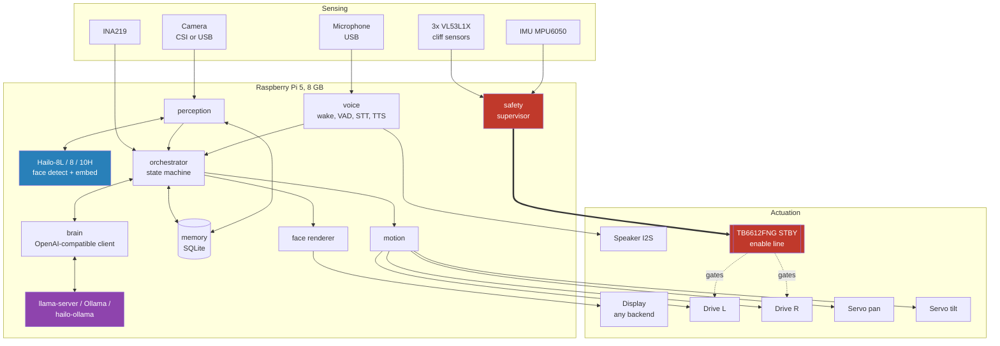

# Plan

Architecture, process model, budgets and build phases. `HARDWARE.md` covers parts and wiring,
`HARDWARE_ABSTRACTION.md` covers how any display, camera and actuator layout is supported,
`INSTALL.md` gets it running, `REVIEW.md` explains what changed from the first draft.

## 0. Principles

1. **Everything runs on the robot.** No cloud, no accounts, no telemetry. Faces, voices and
   memories never leave the SD card.
2. **The face never stutters.** One process per service so the language model cannot starve the
   renderer; the renderer degrades quality before it drops frames.
3. **The safety supervisor is the only thing that can enable the motors**, it does not trust
   anyone, and motion does not trust it for longer than a second either.
4. **Hardware is detected, actuators are declared.** Screens and cameras are plug and play;
   which GPIO you soldered a motor to is a config file.
5. **Everything has a mock.** The whole stack runs on a laptop with no hardware, and CI runs the
   simulator headless on every push.
6. **Reuse before writing.** See `REUSE.md`.

## 1. Architecture



### 1.1 Processes and the bus

Separate OS processes, not threads. A ZeroMQ XSUB/XPUB broker sits in the middle; every service
publishes with a PUB socket and subscribes with a SUB socket by topic prefix. Messages are two
frames: the topic and a msgpack map `{ts, src, seq, data}`. The same services run as threads
over an in-process hub in the simulator and in tests, with identical wire semantics.

| Process | Publishes | Subscribes | Notes |
|---|---|---|---|
| `broker` | | | `zmq.proxy_steerable`, started first |
| `safety` | `safety.state`, `safety.estop` | `motion.heartbeat`, `safety.command` | Owns GPIO26. Real-time-ish: 20 to 100 Hz |
| `motion` | `motion.heartbeat`, `motion.state`, `motion.odometry` | `motion.command`, `safety.state` | 50 Hz servo slew loop. Refuses to drive on stale safety state |
| `face` | `face.state` | `face.*`, `orchestrator.state`, `safety.estop` | 30 fps; adaptive quality |
| `perception` | `perception.faces`, `perception.person`, `perception.enrolled`, `memory.changed` | `perception.enroll`, `memory.changed` | Camera fps; embeds until a track is named |
| `voice` | `voice.wake`, `voice.listening`, `voice.transcript`, `voice.speaking` | `voice.say`, `voice.wake`, `voice.listen` | Wake -> VAD-gated capture -> STT; TTS in a thread |
| `brain` | `brain.response` | `brain.request` | LLM when reachable, scripted replies otherwise; worker thread |
| `orchestrator` | `face.expression`, `face.look`, `motion.command`, `voice.say`, `brain.request`, `perception.enroll`, `orchestrator.state` | `perception.*`, `voice.*`, `brain.response`, `safety.state` | 10 Hz state machine |
| `power` (optional) | `system.battery`, `safety.command` | | INA219 every 5 s |

All topics and payload schemas live in `src/robot/core/messages.py`. Everyone publishes
`service.heartbeat` once a second; systemd's watchdog is fed from the same place.

### 1.2 Repository layout and import rules

```
src/robot/
  core/         config, bus, broker, messages, service loop, vocabulary   (imports nothing above)
  hal/          display, camera, gpio, i2c, actuators, sensors             (mocks for all)
  memory/       SQLite: people, embeddings per backend, facts, events
  provision/    model manifest, resumable downloads, checksums
  face/ perception/ voice/ brain/ motion/ safety/ orchestrator/   services (never import each other)
  sim/          desk world, fake perception, three-panel window, headless mode
  doctor.py     pass/warn/fail checks
  cli/          the `robot` command
```

`import-linter` enforces the layering and the independence of the services in CI. Services
communicate only over the bus, which is what makes the process split and the simulator possible.

### 1.3 Configuration

`defaults.yaml` (in the package) < `config/hardware.yaml` (chassis wiring, may be committed per
build) < `config/local.yaml` (detected display and camera, calibration, never committed) <
`ROBOT__SECTION__KEY` environment < `--set section.key=value`. Pydantic validates the merged
result; unknown keys are errors. `robot config show` prints the effective configuration.

## 2. Budgets

| Resource | Budget | Owner |
|---|---|---|
| RAM, language model | 2.5 GB RSS (Gemma 3 1B uses about 1.2 GB; Qwen3 1.7B about 1.6 GB) | `brain` (systemd `MemoryMax=3500M`) |
| RAM, everything else | < 1.5 GB | perception (~300 MB with OpenCV), voice (~400 MB with STT+TTS loaded), face (~120 MB) |
| CPU, face | one core, 30 fps at 480x480 (`robot bench face`: ~2 ms/frame render at 480) | `face` (`CPUWeight=300`) |
| CPU, LLM | the remaining cores, lowest priority | `brain` (`CPUWeight=50`) |
| Temperature | throttle vision above 75 C, warn above 82 C | `doctor` today; perception frame skipping planned |
| Power | 27 W supply tethered; 25 Wh battery for ~1.6 h untethered | see `HARDWARE.md` 6 |

With an AI HAT+ 2 (Hailo-10H) the language model and speech-to-text move onto the accelerator's
own 8 GB and the CPU budget above becomes mostly slack.

## 3. Safety design

Two independent conditions must both hold for a wheel to turn:

1. The **safety supervisor** drives the enable line. It allows motion only while: the motion
   service's heartbeat is fresh (500 ms), no cliff sensor sees a drop, the IMU does not report
   pickup or tilt, no emergency stop is latched, and the battery is not critical.
2. The **motion service** refuses drive commands unless it has received `safety.state
   enabled=true` within the last second, and halts an ongoing drive the moment that stops being
   true. A dead supervisor therefore stops the robot even before the line falls.

The enable line has two modes. `level` holds GPIO26 high while allowed; a SIGKILLed supervisor
leaves the pin at its last level (a Raspberry Pi does not reset outputs when a process dies),
so `level` alone is not a failsafe. `pulse` emits a square wave that a hardware pulse watchdog
turns into the STBY level; when the pulses stop for ~100 ms, the motors stop. `robot safety
killtest` measures the real behaviour of your wiring, and `robot doctor` warns whenever a
drivetrain is configured with `safety.enable_mode: level`. Build the watchdog (`HARDWARE.md` 5.3) before
the robot is ever untethered on a desk.

Servo protections are in the HAL below any caller: hard angle clamps, slew limits, and auto-relax
after three idle seconds.

## 4. Face

Geometry is a port of Cozmo's procedural eyes (via PyCozmo): two rounded rectangles with
per-corner elliptical radii and two lids each, 43 floats per face, linearly interpolable.
Expressions are parameter presets; transitions, blinks, saccades and idle drift are added by the
animator. The renderer draws antialiased polygons directly at panel resolution; rotation, flip,
round masks and mono presets are handled per panel. The quality controller measures p95 frame
time and degrades in four steps (idle drift, antialiasing, saccade rate, fps).

## 5. Perception

`detector.detect(frame) -> boxes + 5 landmarks`, `embedder.embed(frame, det) -> unit vector`.
CPU backend: YuNet + SFace (128-d, threshold 0.363). Hailo backend: SCRFD + ArcFace (512-d,
threshold 0.5). A small IoU tracker assigns track ids; each track votes on identity until three
consistent matches name it; memory stores several embeddings per person per backend. Unknown
people are asked their name; the answer triggers live enrolment.

## 6. Voice

Wake word (openWakeWord "hey jarvis", or sherpa-onnx keyword spotting for a custom phrase) ->
VAD-gated capture (Silero, energy fallback) -> Moonshine tiny STT -> transcript on the bus.
Speech out: Piper voice through sherpa-onnx's VITS runtime. All engines are behind small
protocols with fakes; the simulator uses the fakes.

## 7. Brain

The orchestrator sends `{text, person, facts, history}`; the brain builds a system prompt with
the persona and remembered facts and asks for a JSON object `{say, expression, gesture,
remember}`. Parsing is tolerant (fenced JSON, prose around JSON, `<think>` blocks, plain text).
Backends: any OpenAI-compatible endpoint (llama-server, Ollama, hailo-ollama), or the scripted
rule set when none is reachable, so the robot always answers. `brain.managed: llama_server`
makes the brain start `llama-server` itself.

## 8. Phases

Each phase ends with something satisfying on its own.

| Phase | You need | Result | Acceptance |
|---|---|---|---|
| 0 Simulator | a laptop | Whole stack in a window | `robot sim`; `uv run pytest`; headless smoke in CI |
| 1 Desk face | Pi 5, HDMI monitor, USB webcam, USB mic/speaker | Face on screen, camera preview | `robot display test`, `robot camera test` |
| 2 Recognition | + Hailo (or CPU backend) | Greets you by name | `robot enroll`; walk out and back in: named in < 1 s |
| 3 Voice | + I2S amp, speaker | Wake word, question, spoken answer | `robot doctor` audio PASS; "hey jarvis, what time is it" |
| 4 Brain | + model download | Real conversation, remembers facts | `robot bench llm` > 6 tok/s; "remember that..." survives a restart |
| 5 Head | + PCA9685, 2 servos, bracket | Head tracks your face | `robot calibrate servos`; head follows within 0.5 s |
| 6 Drive | + TB6612FNG, motors, cliff sensors, watchdog circuit | Drives, stops at edges | `robot safety killtest` PASS; `robot calibrate cliff`; wheels-off-ground test |
| 7 Untethered | + battery, bucks, INA219 | Cordless | `system.battery` on the bus; low-battery speech; critical -> estop |

## 9. Testing strategy

* Unit tests for every layer with mocks (`uv run pytest`, about 130 tests, under a minute).
* Property tests for the letterbox transform (hypothesis).
* Contract tests for the bus (ZeroMQ broker round trip) and the service loop.
* Behavioural tests for the orchestrator with a fake clock.
* `robot sim --headless --seconds 3` runs every service together and asserts a full
  perceive -> wake -> transcribe -> think -> speak cycle; CI runs it on Python 3.11, 3.12, 3.13.
* Hardware tests are CLI commands with a human in the loop (`display test --pattern`,
  `camera bench`, `safety selftest`, `safety killtest`), because a multimeter is the oracle.

## 10. Known gaps and risks

* Nothing has run on a Pi 5 yet. Expect small API mismatches in the HailoRT, picamera2 and
  sherpa-onnx wrappers; each is isolated behind a protocol with a fake.
* Round DSI panels with a supported overlay do not exist; see `HARDWARE.md` 2.2 for the options.
* Software PWM path (DRV8833) will whine. Use the TB6612FNG.
* The hardware pulse watchdog needs bench verification of component values.
* Small language models hallucinate abilities; the persona prompt says what the robot cannot do,
  and every reply is parsed so a malformed one degrades to plain speech rather than a crash.
